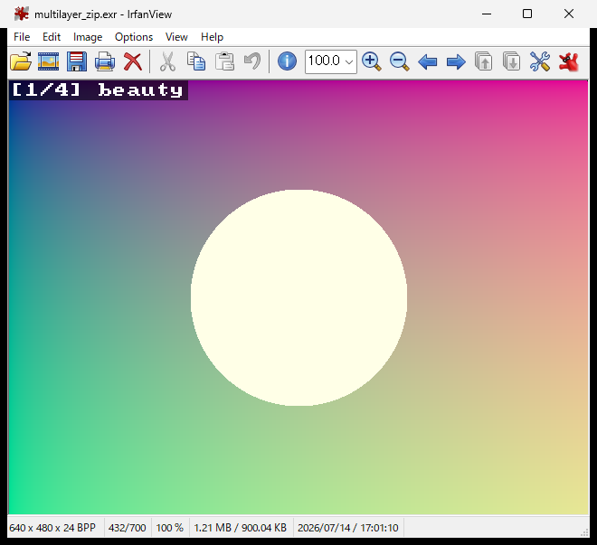
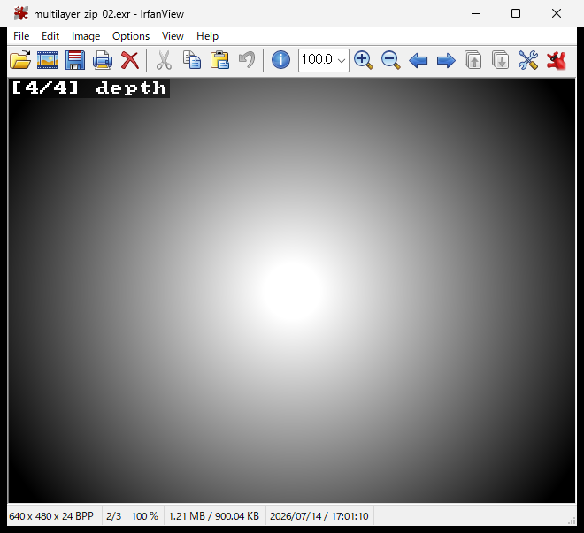

# IrfanView EXR Viewer

A drop-in replacement for IrfanView's EXR plugin (`EXR.dll`) that displays
**multilayer OpenEXR** files and lets you **switch layers / render passes
in-place, inside the same IrfanView window**, with a hotkey.




## Features

- **In-window layer switching** — `Ctrl+Alt+Right` / `Ctrl+Alt+Left` cycle
  through every layer of a multilayer EXR (beauty, diffuse, specular, depth,
  AO, MatID, all the V-Ray passes, …) without opening a new window. The current
  layer shows as a `[n/N] name` caption top-left.
- **Sticky layer across a sequence** — pick a pass (e.g. `depth`), then use
  IrfanView's normal *next image* key (`Right` / `Space` / `PageDown`) to walk
  an EXR image sequence: every frame keeps showing that same pass. An EXR that
  lacks the pass falls back to `beauty`.
- **Real OpenEXR under the hood** — decodes **all** compressions including
  **DWAA/DWAB**, plus **tiled**, **multipart**, and UINT channels. (Statically
  links OpenEXR 3.3, so there are no extra runtime DLLs.)
- **ACES 2.0 view transform** — color layers can be shown through the **ACES 2.0
  SDR sRGB output transform** (input assumed ACEScg / AP1), baked into an
  embedded 3D LUT, instead of a plain linear→sRGB. Toggle it with `Ctrl+Alt+A`;
  the caption shows the active mode (`ACES` or `sRGB`). Default is ACES on.
- **Fast** — lazy per-layer decode with a tone-mapped cache: a large 160 MB /
  20-layer DWAA file opens in ~0.4 s and each new layer appears in ~0.3–0.4 s
  (re-viewing a cached layer is instant). Uses OpenEXR's multithreaded decode.
- **No runtime dependencies** — the prebuilt DLL imports only
  `USER32`/`KERNEL32` (no VC++ redistributable needed).

## How it works

The plugin reads the file bytes with `CreateFileW` (Unicode-safe) and feeds them
to OpenEXR through an in-memory `Imf::IStream`. On open it parses only the
channel list and groups channels into layers. When a layer is requested it
decodes just that layer's channels, tone-maps to a bottom-up 32-bpp DIB, and
caches the result (LRU-bounded). The hotkey advances a global layer index and
posts a `WM_DROPFILES` to IrfanView's own window to reload the file in place;
IrfanView then re-invokes the plugin, which returns the newly selected layer. A
low-level keyboard hook (installed once; the DLL pins itself) captures the
hotkey only while an IrfanView window showing an `.exr` is in the foreground.

## Install (prebuilt)

Requires **64-bit IrfanView** (`i_view64.exe`).

1. Download / clone this repo (or grab `dist/`).
2. Run `dist/install.bat` **as Administrator** — it backs up the stock `EXR.dll`
   to `EXR_original_backup.dll` and installs the new one.

Manual: in `C:\Program Files\IrfanView\Plugins`, rename `EXR.dll` to
`EXR_original_backup.dll` (kept for restore), then copy `dist/EXR.dll` in.
Uninstall: `dist/uninstall.bat` (restores the stock DLL).

## Usage

- Open an `.exr` → beauty layer with a `[1/N] beauty  ACES` caption.
- `Ctrl+Alt+Right` / `Ctrl+Alt+Left` → next / previous layer (same window).
- `Ctrl+Alt+A` → toggle the color view between **ACES 2.0** and plain **sRGB**
  (the caption shows the active mode).
- Switch to a pass, then press IrfanView's *next image* key to browse a
  sequence while staying on that pass.

## Build from source

Needs 64-bit MSVC (VS 2022 or Build Tools) **and static OpenEXR 3.3 libraries**
(with Imath) — see [BUILD.md](BUILD.md) for how to obtain them. Then:

```bat
set OPENEXR_ROOT=C:\path\to\openexr-install
build.bat
```

This produces `dist\EXR.dll` (statically linked `/MT`; no VC++ runtime
dependency).

## Limitations

- 64-bit IrfanView only (the DLL is x64).
- Color passes render via ACES 2.0 (assuming ACEScg/AP1 input) or plain
  linear→sRGB (`Ctrl+Alt+A` toggle); the ACES path is a baked 33³ 3D LUT and is
  ~0.2 s/layer slower than sRGB. Depth-like passes are percentile-normalized
  (near = bright, non-finite/Inf background = black) and are not color-managed.
  The `chromaticities` attribute is not yet honored (ACEScg input is assumed).
- First view of a layer costs a near-full decompress (EXR compresses all
  channels per block); re-viewing is instant. The per-layer BGRX cache is
  bounded to the 12 most-recently-viewed layers.
- `EXRLAYER_FORCE_INDEX` env var forces a specific layer (used for testing).

## 日本語

IrfanView の EXR プラグイン差し替え版です。マルチレイヤ EXR を開き、
`Ctrl+Alt+←/→` で同じウィンドウのままレイヤ（beauty / diffuse / specular /
depth / AO / MatID / 各 V-Ray パス等）を切り替えられます。あるレイヤ（例:
depth）に切り替えた状態で IrfanView 通常の「次の画像」キーを押すと、連番の各
フレームも同じレイヤを表示します。本物の OpenEXR を静的リンクしているので
DWAA/DWAB・タイル・マルチパートを含む全形式に対応。導入は `dist/install.bat`
を管理者実行（詳細は `dist/README.txt`）。**64bit 版 IrfanView 専用**です。

## License

MIT — see [LICENSE](LICENSE). Statically links OpenEXR / Imath (BSD-3-Clause)
and libdeflate (MIT); see
[third_party/THIRD_PARTY_NOTICES.md](third_party/THIRD_PARTY_NOTICES.md).
Not affiliated with or endorsed by IrfanView.
